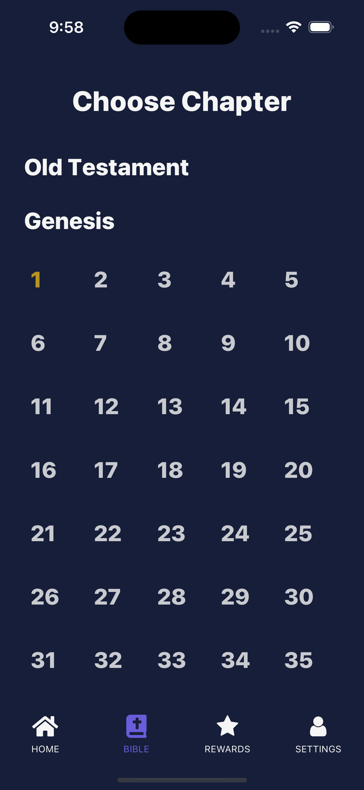
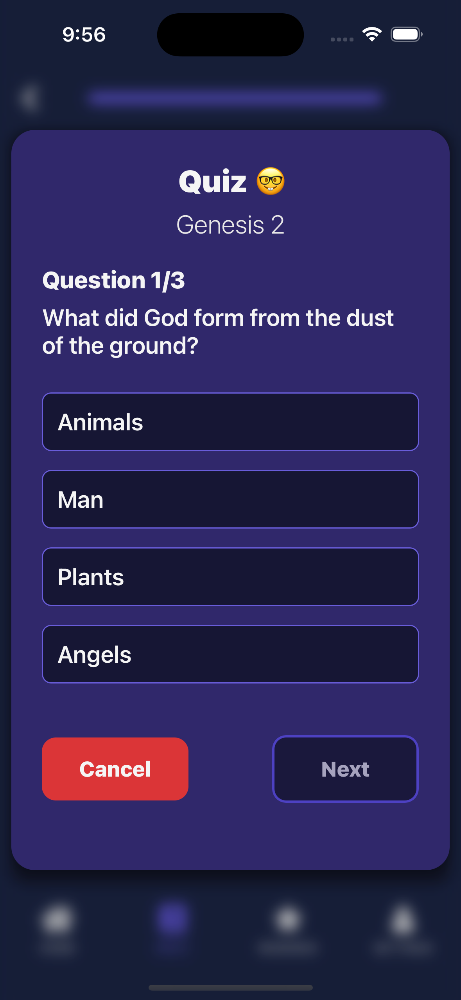
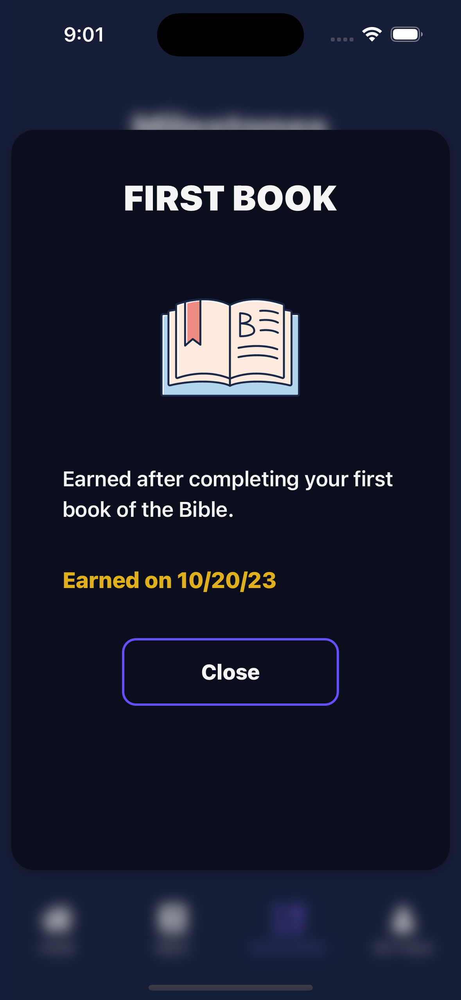

### 1. Project Title and Description

- **Title:** Level Up Bible
- **Description:** Track your Bible reading progress with points and rewards for completing chapters and answering quiz questions.

### 2. Screenshots
       

### 3. Installation and Setup

- **Prerequisites:** Node.js and Expo.
- **Installation:** To install dependancies, simply run:
  ```bash
  npm install
  ```
- **Running the App:** To start up a server and view the app, run:
  ```bash
  npx expo start
  ```

### 4. Technology Stack

- **React Native:** a mobile application library created by Facebook. It is used to develop applications for Android, iOS, and other platforms by enabling developers to use React along with native platform capabilities.
- **Expo:** a set of tools and services built around React Native and native platforms that help develop, build, deploy, and quickly iterate on iOS, Android, and web apps from the same JavaScript/TypeScript codebase.
- **React:** a front-end JavaScript library developed by Facebook for building user interfaces or UI components. Main uses in the app include React hooks such as useState, useEffect, and useRef.
- **React Native Navigation:** provides native navigation on both iOS and Android for React Native apps.
- **Axios:** a simple API and can handle HTTP requests and responses in JSON format. Used for ESV Bible API network call.
- **React Native Netinfo:** a library that allows you to handle network state changes in your app.
- **Redux Toolkit/React Redux/Redux Persist:** Global state manager that consistently updates the JavaScript UI and allows users' data to persist with new app launches.
- **React Native Paper:** a collection of Material Design components for React Native. Used for certain UI elements in the app such as accordion lists, progress bar, etc.
- **Others:** Other, more minor, technologies utilized include React Native Reanimated, Redash, and React Native Circular Progress Indicator.

### 5. Roadmap

- In future iterations of Level Up Bible, we hope to add more features such as: account creation, adding "friends" and sharing your progress socially, tablet support, the ability to adjust fonts, more engaging UI features, and more!

### 6. Copyright

- © 2023 Level Up Bible

### 7. Contact Information

- levelupbible@gmail.com

### 8. Acknowledgments

- A huge shoutout to our friend, Cory for his help and feedback during development! Also a huge thanks to Nicole at Crossway for permission to use the ESV Bible text in Level Up Bible!
